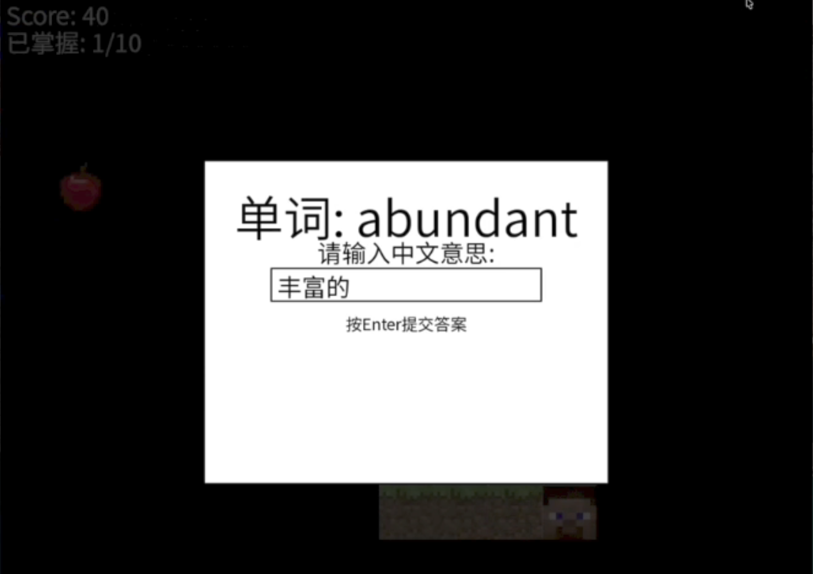
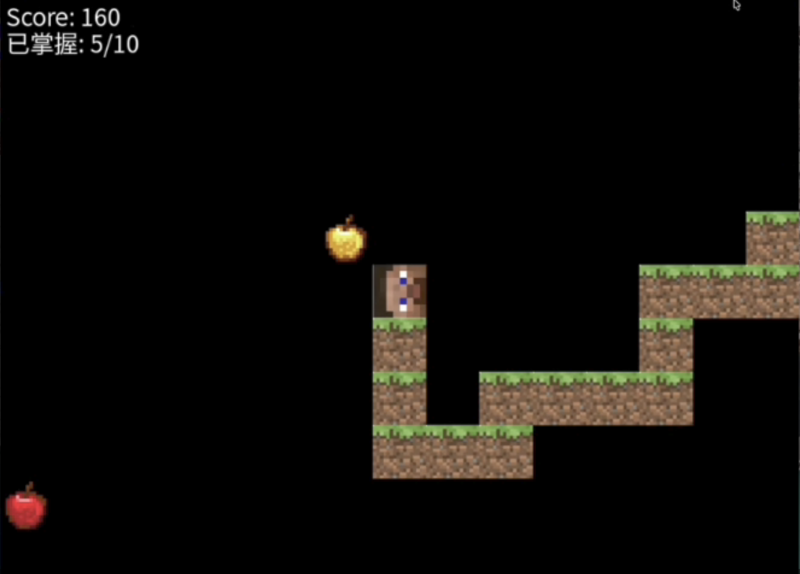

# IELTS Vocab Snake Game 项目展示

## 项目介绍
这是一个结合贪吃蛇游戏与雅思单词学习的教育类游戏，通过游戏化方式帮助用户记忆雅思词汇。

## 核心功能
- 贪吃蛇基础玩法（移动、吃果实得分）
- 每得20分触发单词测试，答对加分、答错减分
- 普通果实与黄金果实（高分奖励）
- 支持单词库扩展（`words.json`）

## 游戏截图

## 代码仓库
[查看源代码](https://github.com/pacmen666/SE_Project)